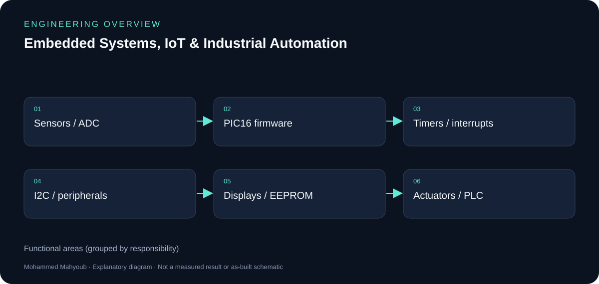

# Embedded Systems, IoT & Industrial Automation

## Illustrated engineering guide

[Read the full engineering guide](docs/engineering-guide.md) for architecture, workflow, design rationale, evidence notes and the source gallery.

*Explanatory diagram added for this write-up.*

**Author:** Mohammed Mahyoub.

Designed and prototyped embedded monitoring and control solutions using microcontrollers, sensors, communication modules, actuators, and PLC platforms.

## Scope

Real-time monitoring and control systems, sensor integration, telemetry, hardware configuration, functional testing, and technical validation.

## Firmware

PIC16 firmware in mikroC, simulated in Proteus and built on hardware: multiplexed 7-segment displays, ADC measurement with Timer0 interrupts, EEPROM storage, DS1307 RTC over I²C, 74HC595 shift registers, keypad/LCD access control with alarm, and Nokia 5110 graphic LCD.

## Devices

IC and memory programming: ROM/PROM/EPROM/EEPROM/Flash, SRAM/DRAM/NV-RAM organisation, and hardware device programmers.

## Technologies

PIC, mikroC, Proteus, AVR, Arduino, Sensors, PLC, IoT

## Links

- [Portfolio project](https://mahyoub88.github.io/#proj-embedded-iot)
