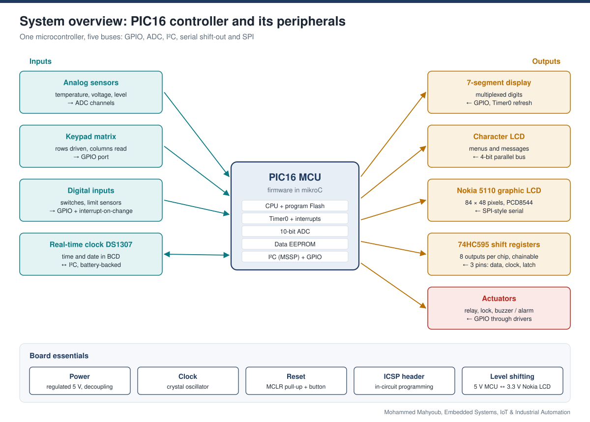
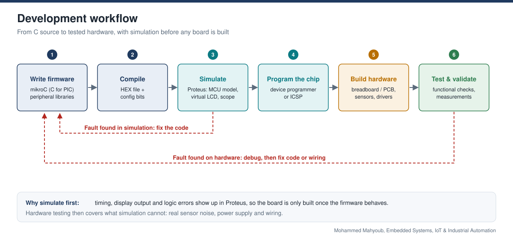
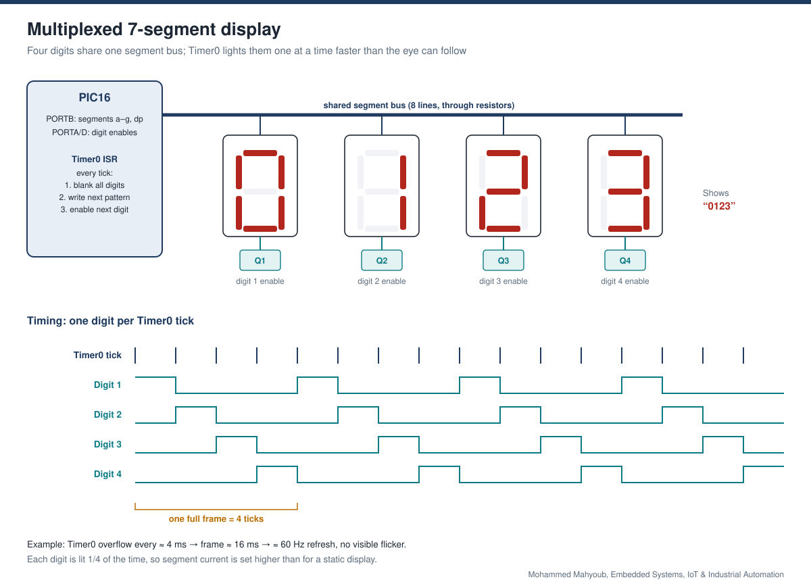
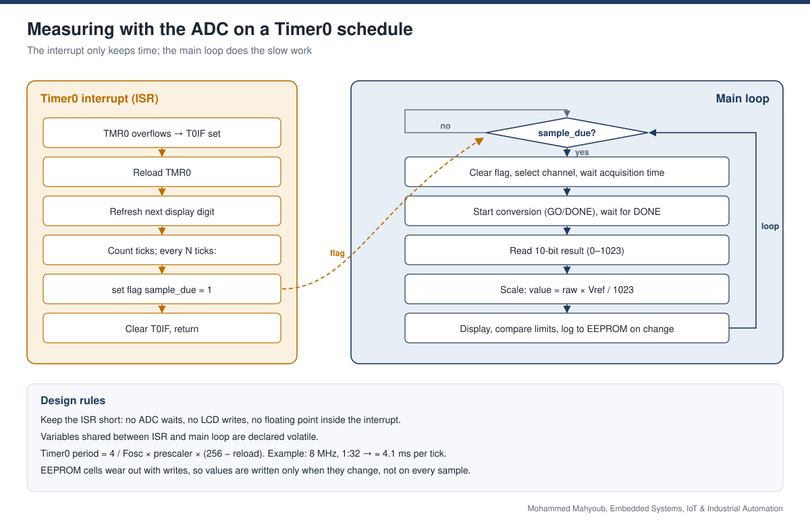
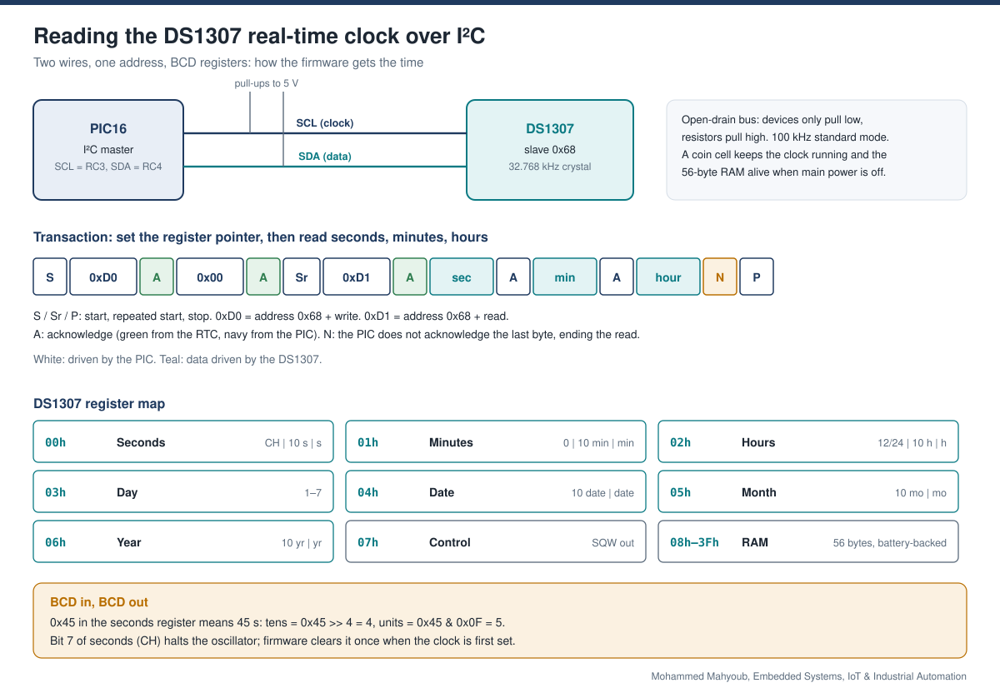
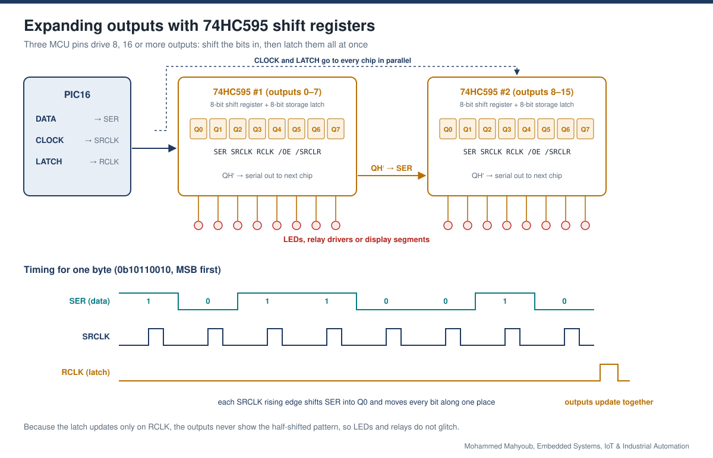
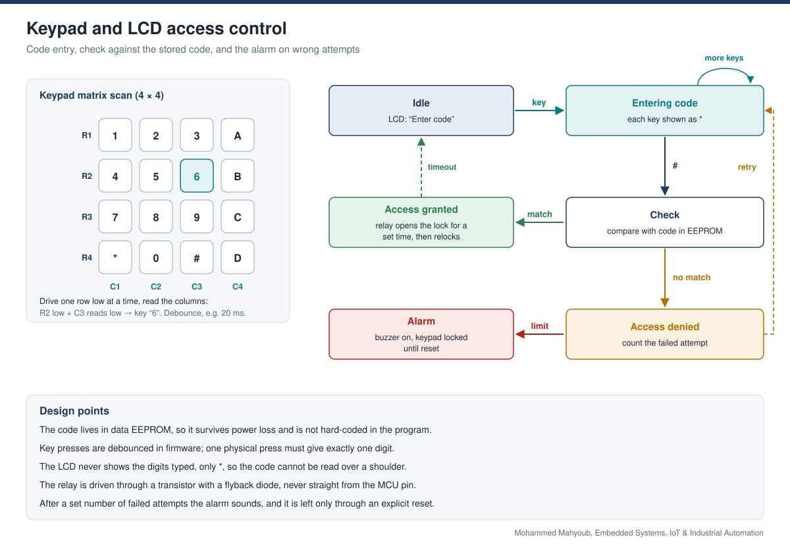
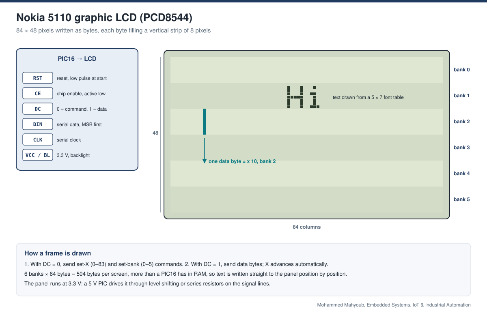
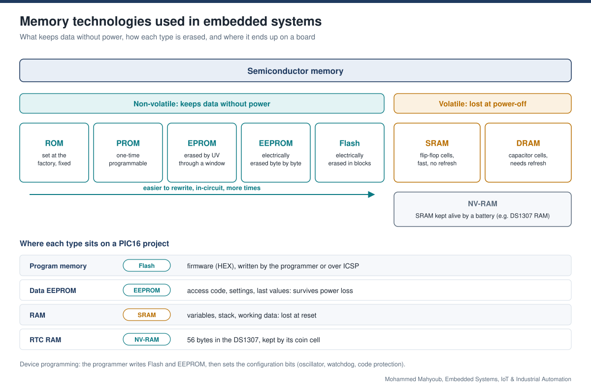

# Embedded Systems, IoT & Industrial Automation

Designed and prototyped embedded monitoring and control solutions using microcontrollers, sensors, communication modules, actuators and PLC platforms. Most of the firmware targets PIC16 microcontrollers, written in mikroC, simulated in Proteus and then built and tested on hardware.

**Author:** Mohammed Mahyoub · [Portfolio](https://mahyoub88.github.io/#proj-embedded-iot)

## At a glance

| Aspect | Detail |
|---|---|
| Main controller | PIC16 family (8-bit), firmware in mikroC |
| Other platforms | AVR, Arduino, PLC |
| Tools | mikroC, Proteus simulation, device programmer / ICSP |
| Interfaces | GPIO, 10-bit ADC, Timer0 interrupts, I²C, serial shift-out, SPI-style serial |
| Peripherals | Multiplexed 7-segment displays, character LCD, Nokia 5110 graphic LCD, DS1307 RTC, 74HC595 shift registers, keypad, relays and buzzers |
| Storage | On-chip data EEPROM, battery-backed RTC RAM |
| Scope | Real-time monitoring and control, sensor integration, telemetry, hardware configuration, functional testing and validation |

## Contents

1. [System overview](#1-system-overview)
2. [Development workflow](#2-development-workflow)
3. [Multiplexed 7-segment displays](#3-multiplexed-7-segment-displays)
4. [Analog measurement on a Timer0 schedule](#4-analog-measurement-on-a-timer0-schedule)
5. [Real-time clock (DS1307)](#5-real-time-clock-ds1307)
6. [Output expansion with 74HC595](#6-output-expansion-with-74hc595)
7. [Keypad and LCD access control](#7-keypad-and-lcd-access-control)
8. [Nokia 5110 graphic LCD](#8-nokia-5110-graphic-lcd)
9. [Memory technologies and device programming](#9-memory-technologies-and-device-programming)
10. [Beyond PIC: AVR, Arduino, PLC and IoT](#10-beyond-pic-avr-arduino-plc-and-iot)
11. [Validation checklist](#11-validation-checklist)

The code blocks below are short reference snippets in mikroC style that show how each technique works.

## 1. System overview

A single PIC16 sits at the centre. Sensors, the keypad, digital inputs and the real-time clock feed it; displays, shift registers and actuators are driven by it. Each peripheral uses the bus that suits it: the ADC for analog sensors, I²C for the clock, a three-wire serial shift-out for extra outputs and an SPI-style link for the graphic LCD.

## 2. Development workflow

Every design goes through the same loop: write the firmware in mikroC, compile it to a HEX file, run it in Proteus against simulated displays and sensors, then program the real chip and test it on the board. Faults found in simulation go straight back to the code; faults found on hardware are debugged first, because the cause may be wiring or power rather than firmware.

## 3. Multiplexed 7-segment displays

Driving four digits directly would take 32 pins. Multiplexing shares one 8-line segment bus between all digits and switches each digit on through its own transistor. The Timer0 interrupt lights one digit per tick: blank, load the next pattern, enable the next digit. At around 60 full refreshes per second the eye sees all four digits lit at once.

~~~c
volatile unsigned char digit = 0;
unsigned char pattern[4];            // segment pattern for each digit

void interrupt() {
  if (INTCON.T0IF) {
    TMR0 = 0;                        // reload
    PORTD = 0x00;                    // 1. blank all digits (no ghosting)
    PORTB = pattern[digit];          // 2. next segment pattern
    PORTD = 1 << digit;              // 3. enable that digit
    digit = (digit + 1) & 0x03;
    INTCON.T0IF = 0;
  }
}
~~~

Blanking before changing the pattern matters: without it, the previous digit briefly shows the next digit's segments.

## 4. Analog measurement on a Timer0 schedule

The same Timer0 tick also paces measurements. The interrupt only counts ticks and sets a flag; the main loop sees the flag, runs the ADC conversion, scales the result and updates the display. Slow work stays out of the interrupt, so the display refresh never stutters.

~~~c
volatile unsigned char tick = 0, sample_due = 0;
// in the Timer0 ISR:  if (++tick >= 50) { tick = 0; sample_due = 1; }

void main() {
  unsigned int raw;
  unsigned long mv;
  /* port, ADC and Timer0 setup here */
  while (1) {
    if (sample_due) {
      sample_due = 0;
      raw = ADC_Read(0);                        // 10-bit: 0..1023
      mv  = (unsigned long)raw * 5000 / 1023;   // Vref = 5 V
      /* update display, check limits, store on change */
    }
  }
}
~~~

**Timer0 period** = 4 / Fosc × prescaler × (256 − reload). With an 8 MHz crystal and a 1:32 prescaler that is about 4.1 ms per tick, so 50 ticks give a sample roughly every 200 ms.

Values that must survive a power cut go to the data EEPROM. EEPROM cells have a limited number of write cycles, so a value is written only when it changes.

## 5. Real-time clock (DS1307)

The DS1307 keeps time and date on its own 32.768 kHz crystal and a coin cell, so the clock keeps running when the board is off. The PIC talks to it as an I²C master over two open-drain lines with pull-up resistors. A read sets the register pointer to 00h, then reads seconds, minutes and hours in one burst.

~~~c
unsigned char sec, min, hr;

I2C1_Start();
I2C1_Wr(0xD0);            // address 0x68 + write
I2C1_Wr(0x00);            // register pointer = seconds
I2C1_Repeated_Start();
I2C1_Wr(0xD1);            // address 0x68 + read
sec = I2C1_Rd(1);         // ACK: more bytes follow
min = I2C1_Rd(1);
hr  = I2C1_Rd(0);         // NACK: last byte
I2C1_Stop();

seconds = ((sec >> 4) & 0x07) * 10 + (sec & 0x0F);   // BCD to binary
~~~

The registers hold BCD, not binary: 0x45 means 45. The top bit of the seconds register (CH) stops the oscillator, so it is cleared when the clock is first set.

## 6. Output expansion with 74HC595

When a design needs more outputs than the PIC has pins, 74HC595 shift registers add them eight at a time using only three pins: data, shift clock and latch. Bits are clocked in one by one, then a single latch pulse copies all of them to the outputs together. Chips chain through their serial-out pin, so 16 or 24 outputs still need only those three pins.

~~~c
void shift_out(unsigned char b) {
  unsigned char i;
  for (i = 0; i < 8; i++) {
    DATA_PIN = (b & 0x80) ? 1 : 0;   // MSB first
    CLK_PIN = 1;                     // rising edge shifts the bit in
    CLK_PIN = 0;
    b <<= 1;
  }
}

shift_out(high_byte);                // travels on to chip #2
shift_out(low_byte);                 // stays in chip #1
LATCH_PIN = 1; LATCH_PIN = 0;        // all outputs change together
~~~

## 7. Keypad and LCD access control

A keypad and character LCD form a code lock. The keypad is scanned as a matrix: one row is pulled low at a time and the columns are read, so 16 keys need only 8 pins. The entered code is shown as asterisks and compared with the code stored in EEPROM. A match opens the lock through a relay for a set time; a wrong code is counted, and repeated failures trigger the alarm.

## 8. Nokia 5110 graphic LCD

The Nokia 5110 module uses the PCD8544 controller: 84 × 48 pixels driven over a serial link with a data/command pin. Display memory is organised in six banks of eight pixel rows. Each byte sent fills one 8-pixel vertical strip, and the column address advances on its own, so text is drawn by sending the columns of each character from a 5 × 7 font table. The panel runs at 3.3 V, so its inputs from a 5 V PIC are level-shifted.

## 9. Memory technologies and device programming

Part of the work covered memory devices and how they are programmed: mask ROM, PROM, UV-erasable EPROM, EEPROM and Flash on the non-volatile side; SRAM, DRAM and battery-backed NV-RAM on the volatile side. On a PIC16 project they map directly to program Flash, data EEPROM, RAM and the DS1307's battery-backed RAM. Hardware device programmers were used to write and verify ICs and memories.

## 10. Beyond PIC: AVR, Arduino, PLC and IoT

The same design approach carried over to other platforms:

- **AVR and Arduino:** sensor nodes and quick prototypes using the same building blocks (ADC sampling, timers, I²C and serial peripherals).
- **PLC:** industrial control logic, with sensors and actuators wired to PLC inputs and outputs.
- **IoT and telemetry:** sensor readings sent from the embedded node to a monitoring application. The desktop side of this work is in [dotnet-monitoring-apps](https://github.com/Mahyoub88/dotnet-monitoring-apps).

## 11. Validation checklist

The checks below cover each building block, from simulation to the finished board.

| Test | What is checked |
|---|---|
| Simulation in Proteus | Logic, timing and display output before any hardware is built |
| Display test | Every segment and digit lights; no ghosting or flicker |
| ADC check | Readings against a multimeter at several input voltages |
| RTC check | Time is kept across a power cycle on the backup cell |
| Shift-register test | Each output toggles alone; no glitches while shifting |
| Access control | Correct code opens, wrong code is counted, alarm triggers and resets as designed |
| Power and drivers | Supply stays stable with relays switching; flyback diodes in place |

## Technologies

PIC16, mikroC, Proteus, AVR, Arduino, PLC, ADC, Timer0 interrupts, EEPROM, I²C, DS1307, 74HC595, 7-segment multiplexing, character LCD, Nokia 5110 / PCD8544, keypad matrix, relays, device programming, IoT telemetry

## Training

PIC Microcontroller Programming with mikroC and Proteus (Microcontroller Programming Techniques training group).

## Related

- [Engineering Monitoring & Automation Applications (.NET)](https://github.com/Mahyoub88/dotnet-monitoring-apps)
- [Reconnaissance Robot: RGB-D Mapping & Remote Control](https://github.com/Mahyoub88/reconnaissance-robot-rgbd)
- [All projects](https://mahyoub88.github.io/#work)
