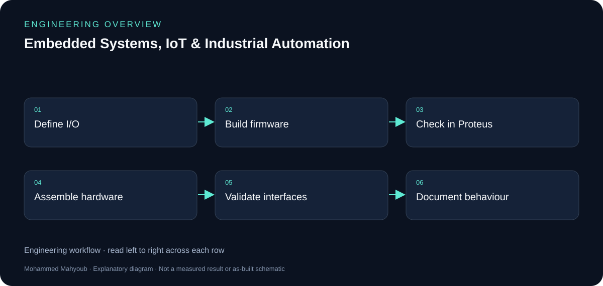
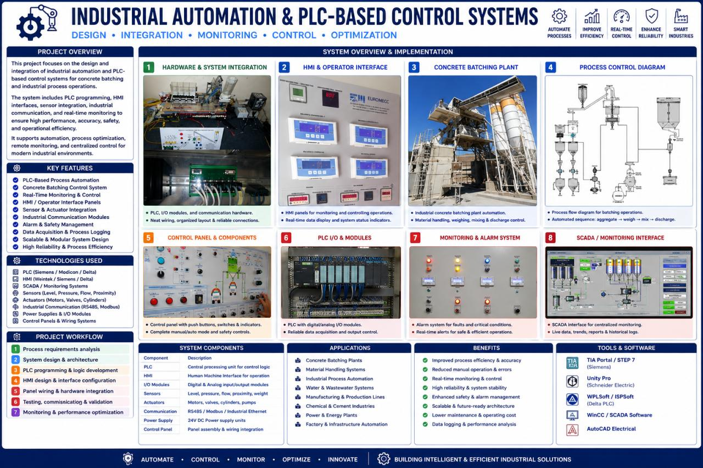

# Embedded Systems, IoT & Industrial Automation — Engineering Guide

Designed and prototyped embedded monitoring and control solutions using microcontrollers, sensors, communication modules, actuators, and PLC platforms.

## Visual overview

*New explanatory diagram; grouped responsibilities, not an as-built schematic or test result.*

*New explanatory workflow; a documentation aid, not evidence that every proposed check was performed.*

## Peripherals and timing

The documented PIC16 work includes multiplexed displays, ADC measurements with Timer0 interrupts, EEPROM persistence, a DS1307 clock over I2C, 74HC595 shift registers, keypad/LCD access control and a Nokia graphic LCD. Timing, pin allocation and shared interfaces make these useful integration examples.

## Hardware validation

Proteus supports development before hardware assembly; the public scope also records hardware implementation and functional testing. New diagrams group the techniques by responsibility and do not imply that every peripheral was installed in one circuit.

## Authorship and reuse

The training archive includes third-party code, libraries and device models. Mohammed applied and developed on those techniques, including hardware work. This documentation credits the training origin and does not republish the pack as original source code.

## Evidence to review or collect

The following are suggested review checks. A checklist entry is not a claimed pass result.

- Pin map and electrical interface assumptions.
- Timer/ADC/peripheral behaviour.
- EEPROM persistence and clock/display output.
- Hardware observations with training attribution.

## Source gallery

*Industrial Automation & PLC-Based Control Systems — LinkedIn project media.*

## Sources and provenance

- [Published portfolio description](https://mahyoub88.github.io/#proj-embedded-iot).
- [Project README](../README.md) and existing repository files.
- [LinkedIn projects](https://www.linkedin.com/in/mohammed-mahyoub/details/projects/): supplementary descriptions and project media.
- New SVG figures and explanatory text were authored for this documentation update; they are not original photographs or new measured results.
- Reused JPG media were exported from the corresponding LinkedIn project media viewer. Source titles are preserved in the captions; no expiring image URLs are required.
- PIC examples originate in the Microcontroller Programming Techniques training pack; third-party code/libraries are not republished as original work.
